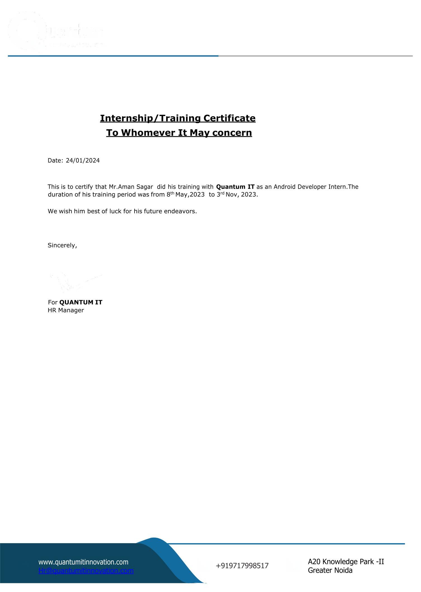

<h1 align="center">Hi 👋, I'm Aman Sagar</h1>
<h3 align="center">Full stack MERN developer</h3>

  &nbsp;&nbsp;&nbsp;&nbsp;
  
&nbsp;&nbsp;&nbsp;&nbsp;

## 👀 About Me

A full-stack MERN developer specialized in building real-time applications using modern technologies like React, TypeScript, Express, Socket.IO, MongoDB, and Docker, with a strong focus on delivering high-quality, user-centric solutions.

## 💼 Internship

During my internship at **Quantum IT Innovation**, I worked on Android application development, gaining hands-on experience with Kotlin, Jetpack compose, Rest apis, and other Android technologies.

## 🚀 Projects

🔍 __Currently looking for remote work opportunities__ 

 
